# 无人机硬件清单

| 硬件名 | 数量 | 功能简介 |
|---|---:|---|
| 边缘计算机套件：Nvidia Orin NX | 1 | [查看详细介绍](#detail-orin-nx) |
| RGB-D 深度相机：RealSense D455 | 1 | [查看详细介绍](#detail-d455) |
| 飞控：NxtPX4 | 1 | [查看详细介绍](#detail-nxtpx4) |
| 电调：45A（当前使用，型号待补充） | 1 | [查看详细介绍](#detail-esc-45a) |
| 电调：HobbyWing 65A（不再使用） | 1 | [查看详细介绍](#detail-esc) |
| 电机：OddityRC 2006 2150KV 四个装 | 1 | [查看详细介绍](#detail-motor) |
| 螺旋桨：GEMFAN D90s-3 四个装 | 1 | [查看详细介绍](#detail-propeller) |
| 电池：1400mAh 6S | 1 | [查看详细介绍](#detail-battery) |
| 电池防撞护垫 | 1 | [查看详细介绍](#detail-battery-protector) |
| 电池绑带：凯夫拉 20×280mm 防滑扎带 | 2 | [查看详细介绍](#detail-battery-strap) |
| 桨叶保护罩：OddityRC XI35 Pro | 1 | [查看详细介绍](#detail-prop-guard) |
| 接收器：瑞速 | 1 | [查看详细介绍](#detail-receiver) |
| 遥控器 | 1 | [查看详细介绍](#detail-transmitter) |
| 电源接口：XT60 E1-M | 1 | [查看详细介绍](#detail-xt60-em) |
| XT30 对（10 个装） | 1 | [查看详细介绍](#detail-xt30) |
| 计算机电源线：18 AWG 红色，1m 长 | 4 | [查看详细介绍](#detail-power-red) |
| 计算机电源线：18 AWG 黑色，1m 长 | 4 | [查看详细介绍](#detail-power-black) |
| 硅胶线：12 AWG 红色，3.4平方，1m 长 | 2 | [查看详细介绍](#detail-wire-12awg-red) |
| 硅胶线：12 AWG 黑色，3.4平方，1m 长 | 2 | [查看详细介绍](#detail-wire-12awg-black) |
| 硅胶线：28 AWG 绿色，0.08平方，5m 长 | 1 | [查看详细介绍](#detail-wire-28awg-green) |
| 硅胶线：28 AWG 白色，0.08平方，5m 长 | 1 | [查看详细介绍](#detail-wire-28awg-white) |
| 硅胶线：28 AWG 红色，0.08平方，5m 长 | 1 | [查看详细介绍](#detail-wire-28awg-red) |
| 硅胶线：28 AWG 黑色，0.08平方，5m 长 | 1 | [查看详细介绍](#detail-wire-28awg-black) |
| 相机 Type-C 线 | 1 | [查看详细介绍](#detail-camera-cable) |
| 4 针串口线（20cm） | 4 | [查看详细介绍](#detail-uart) |
| Type-C 调试母座（机架下板安装位） | 1 | [查看详细介绍](#detail-debug-female) |
| Type-C 调试公头 | 1 | [查看详细介绍](#detail-debug-male) |
| DC-DC 降压模块，输出 12V 5A | 1 | [查看详细介绍](#detail-dcdc) |
| 936 烙铁头：黑金刚 SK 小刀型 | 1 | [查看详细介绍](#detail-solder-tip) |
| 焊锡丝：63% 锡，1.2mm，55g/卷，含松香芯 | 1 | [查看详细介绍](#detail-solder-wire) |
| 铝合金支柱：M3×12mm | 16 | [查看详细介绍](#detail-standoff) |
| 铝合金支柱：M3×20mm，亮黑色 | 20 | [查看详细介绍](#detail-standoff-m3-20) |
| 铝合金支柱：M3×60mm，亮黑色 | 10 | [查看详细介绍](#detail-standoff-m3-60) |
| 内六角沉头螺丝（150 个装） | 1 | [查看详细介绍](#detail-screw) |
| 内六角螺丝：M3×10mm | 1 | [查看详细介绍](#detail-screw-m3-10) |
| 尼龙螺丝：M2×20mm，白色，30颗装 | 1 | [查看详细介绍](#detail-nylon-screw-m2-20) |
| 尼龙螺母：M2，白色，50颗装 | 1 | [查看详细介绍](#detail-nylon-nut-m2) |
| 内六角沉头螺丝：M3×20mm，100只装 | 1 | [查看详细介绍](#detail-countersunk-m3-20) |
| 内六角沉头螺丝：M2.5×10mm，100只装 | 1 | [查看详细介绍](#detail-countersunk-m2-5-10) |
| 缓冲泡棉（用于电池，2m） | 1 | [查看详细介绍](#detail-foam) |
| 3M 背胶魔术贴：黑色，2cm 宽，3m 勾面 + 3m 毛面 | 1 | [查看详细介绍](#detail-velcro) |
| 尼龙扎带：白色，25cm，中粗，100条装 | 1 | [查看详细介绍](#detail-zip-tie) |
| 米乐奇阻燃双面胶（黑色 EVA 泡棉，1mm 厚，20mm 宽 × 5m 长） | 1 | [查看详细介绍](#detail-eva-tape) |
| 固态电容：680µF（更紧凑） | 1 | [查看详细介绍](#detail-capacitor) |
| 热缩管：5mm 红色（2m） | 1 | [查看详细介绍](#detail-heatshrink-red) |
| 热缩管：5mm 黑色（2m） | 1 | [查看详细介绍](#detail-heatshrink-black) |
| 热缩管：黑色，圆直径 4mm，按 2m 散卖 | 1 | [查看详细介绍](#detail-heatshrink-4mm) |
| 热缩管：黑色，圆直径 2mm，按 2m 散卖 | 1 | [查看详细介绍](#detail-heatshrink-2mm) |
| 螺丝胶：263 红色，高强度耐油性，50mL | 1 | [查看详细介绍](#detail-threadlocker-263) |
| 公牛插排：B5440，3m，带过载保护 | 1 | [查看详细介绍](#detail-power-strip) |
| 3K 东丽碳纤维板定制加工 | 1 | [查看详细介绍](#detail-carbon-fiber) |
| PETG 3D 打印定制件 | 6 | [查看详细介绍](#detail-petg-print) |
| BB 响 | 2 | [查看详细介绍](#detail-buzzer) |
| XT60 公母头（5 对） | 1 | [查看详细介绍](#detail-xt60-pair) |

## 硬件详细介绍

### 边缘计算机套件：Nvidia Orin NX

**具体型号：**

Allspark 2-Orin NX 16G+128G SSD+wifi版本 100TOPS

**功能简介：**

Nvidia Orin NX 是无人机上的机载边缘计算平台。

**安装与使用说明：**

待补充。

**参考图片：**

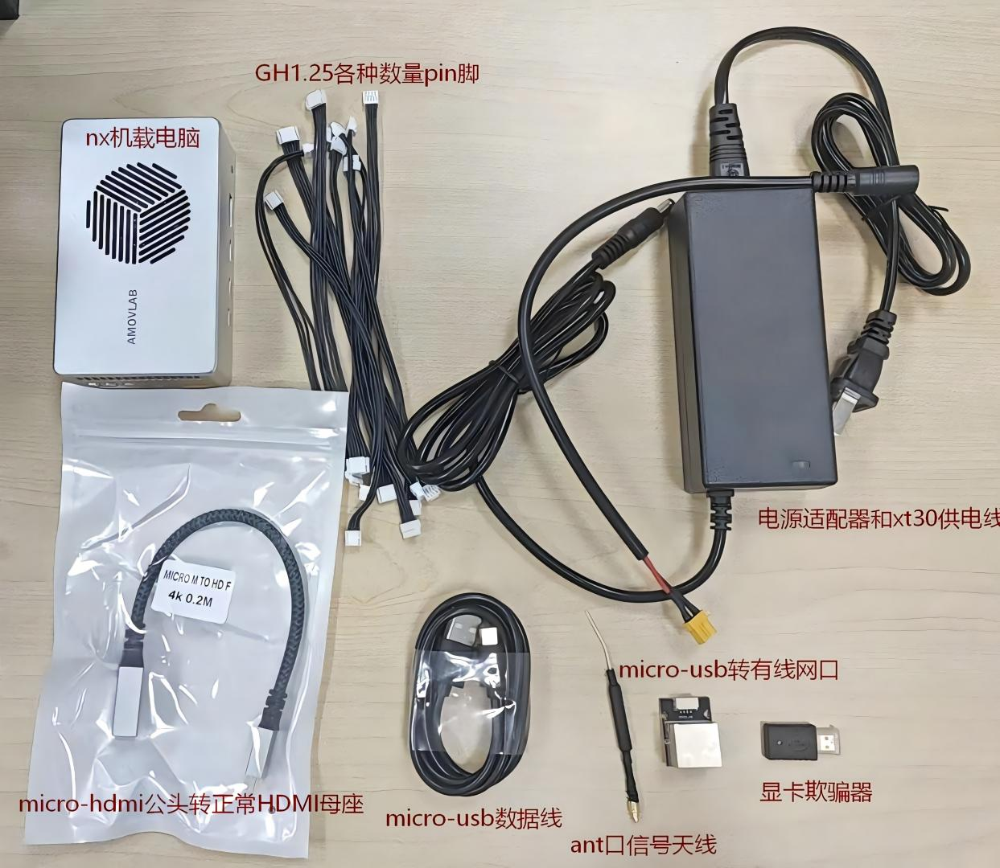

**淘宝购买链接：**

[点击查看机载电脑商品（SKU：5396774401953）](https://item.taobao.com/item.htm?id=705748339987&skuId=5396774401953)

[返回硬件清单](#hardware-list)

### RGB-D 深度相机：RealSense D455

**功能简介：** 用于采集彩色图像和深度信息，为目标识别、测距、避障和定位提供视觉数据。

**安装方法：** 将相机固定在3D打印件上，3D打印件安装在机头。

**参考图片：**

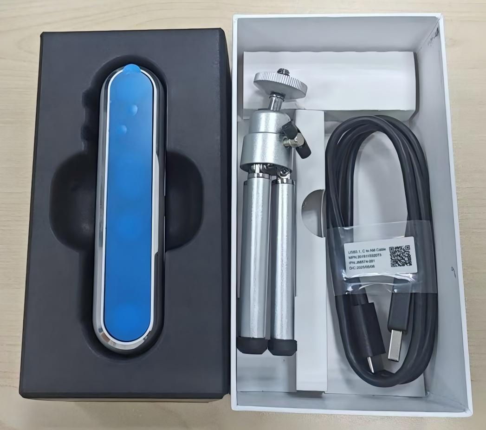

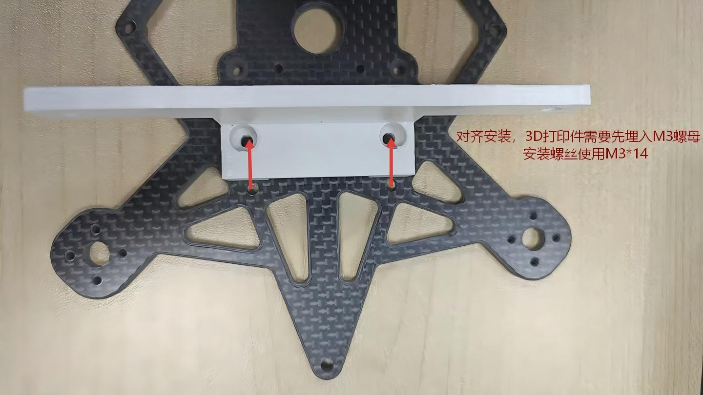

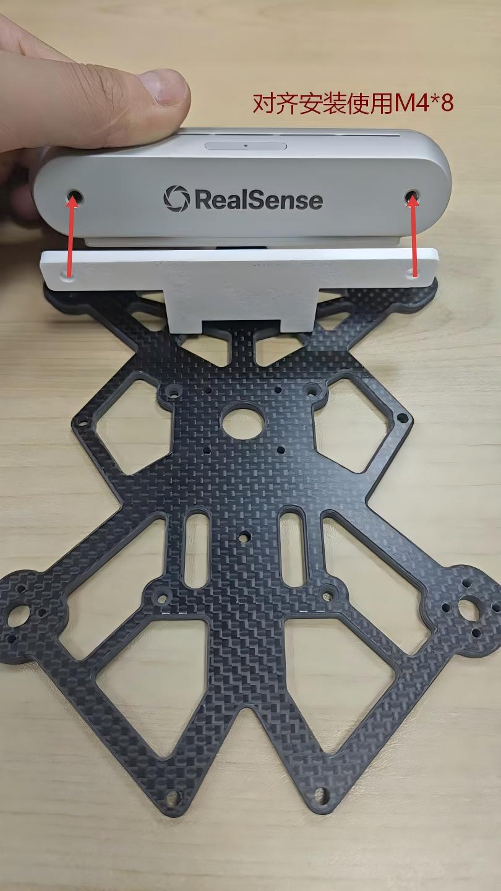

**淘宝购买链接：**

[点击查看深度相机商品（SKU：4457168412136）](https://item.taobao.com/item.htm?id=559722720199&skuId=4457168412136)

[返回硬件清单](#hardware-list)

### 飞控：NxtPX4

**功能简介：** 负责姿态估计、飞行控制、电机输出以及与遥控器、接收器和机载计算机的通信。

**安装方法：** 安装在机架上板下表面20*20安装孔，按照飞控箭头朝向机头；使用减震柱固定，固定螺丝使用尼龙螺丝减少震动，M2\*15尼龙螺丝，配M2螺母，如果和小尺寸4合1电调组成飞塔则需要更长的螺丝M2\*25。

**淘宝购买链接：**

[点击查看飞控商品（SKU：6048678263114）](https://item.taobao.com/item.htm?id=955672079963&skuId=6048678263114)

[返回硬件清单](#hardware-list)

### 4合1电调：HobbyWing 65A（不再使用）

**功能简介：** 将电池的直流电转换为三相驱动信号，控制无刷电机的转速和方向。

**状态：** 该 65A 电调为历史采购记录，当前方案不再使用，已改用尺寸匹配的 45A 电调。

**安装方法：** 当前不安装。若作为实验备件使用，应根据实际安装孔位固定，并确认电源线、三相线和信号线连接正确，同时检查散热与绝缘。

**历史安装示意图：**

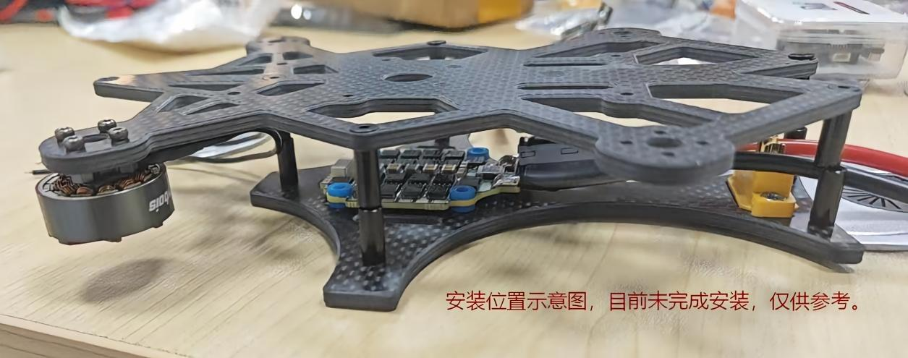

**淘宝购买链接：**

[点击查看好盈 65A 电调商品（SKU：6056332788771）](https://item.taobao.com/item.htm?id=595061218864&skuId=6056332788771)

[返回硬件清单](#hardware-list)

### 4合1电调：45A（当前使用）

**功能简介：** 将 6S 电池的直流电转换为三相驱动信号，控制四个无刷电机的转速和方向。

**状态：** 当前方案使用尺寸匹配的 45A 电调，具体品牌、型号和淘宝购买链接待补充。

**安装方法：** 按 45A 电调实物的安装孔位固定在机架内，优先与飞控组成稳定的飞塔或按机架预留孔位安装；电源线接电源分配端，三相线接对应电机，信号线接飞控。上电前检查极性、短路、线序和散热空间。

[返回硬件清单](#hardware-list)

### 电机：OddityRC 2006 2150KV 四个装

**安装方法：** 将四个电机分别固定在机臂末端，按飞控配置区分顺时针和逆时针位置；螺丝长度不能顶到电机绕组，接好三相线后手动转动检查是否有卡滞，本款电机是光轴且有两个桨叶安装孔需配合对应型号桨叶。

**参考图片：**

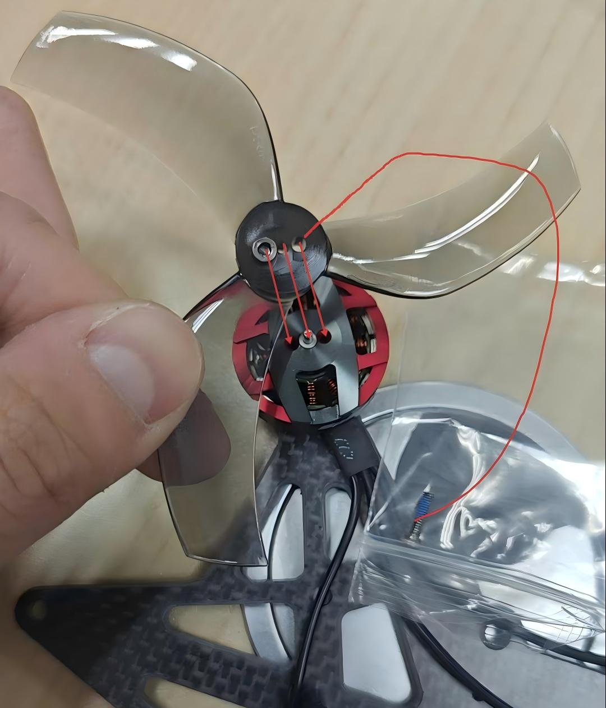

**历史购买链接：**

[查看原 OddityRC 2006 电机商品（已售罄）](https://item.taobao.com/item.htm?id=793989229752&sku_properties=1627207%3A32402027293)

> 该商品已经卖完，此链接仅用于记录当初购买的型号，不代表当前可购买。

[返回硬件清单](#hardware-list)

### 螺旋桨：GEMFAN D90s-3 四个装

**功能简介：** 将电机的旋转动力转换为升力和推力，是无人机产生飞行动力的部件。

**安装方法：** 按桨叶方向和飞控设置分别安装正桨、反桨；首次通电调试时先拆下螺旋桨，确认电机方向正确后再安装，三个安装孔的桨叶要配合对应安装孔的电机，安装时注意电机按照对应旋转方向时，桨叶是否能正常产生正确的推力。

**参考图片：**

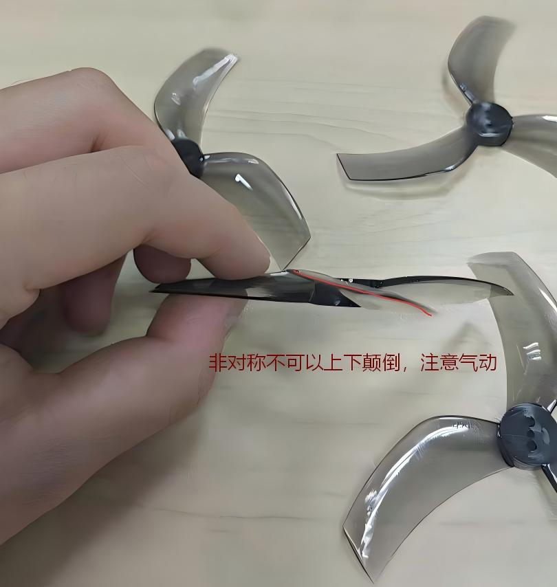

**购买链接：**

[点击查看三孔螺旋桨商品（SKU：5675481147990）](https://item.taobao.com/item.htm?id=811737228893&skuId=5675481147990)

> 本电机为中间光轴、两侧带安装孔，因此选用三孔螺旋桨；如果电机只有中间单轴、没有两侧安装孔，应改用单孔螺旋桨。

[返回硬件清单](#hardware-list)

### 电池：1400mAh 6S

**功能简介：** 为电机、电调和机载电子设备提供 6S 直流电源，是无人机的主要动力能源。

**安装方法：** 将电池放在机架重心附近，用电池泡棉和绑带双重固定；接入 XT60 前检查极性和电压，飞行后及时断开并按 6S 电池规范充电、存放。

**参考图片：**

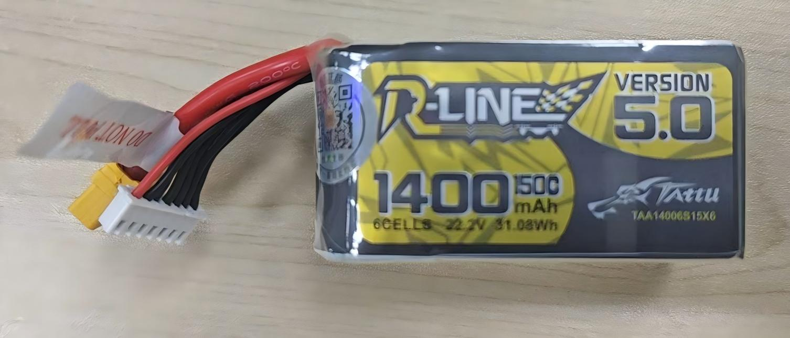

**淘宝购买链接：**

[点击查看淘宝商品（SKU：5449796720472）](https://item.taobao.com/item.htm?id=677691756050&skuId=5449796720472)

**参考购买价：** 166.50 元

[返回硬件清单](#hardware-list)

### 电池防撞护垫

**功能简介：** 用于缓冲电池与机架或周边结构的碰撞，减少电池外壳磨损和飞行振动。

**安装方法：** 将护垫贴合或固定在电池容易碰撞的边缘和接触面，粘贴前清洁表面；安装后仍需使用电池绑带固定，不能只依靠护垫承受飞行冲击。

**参考图片：**

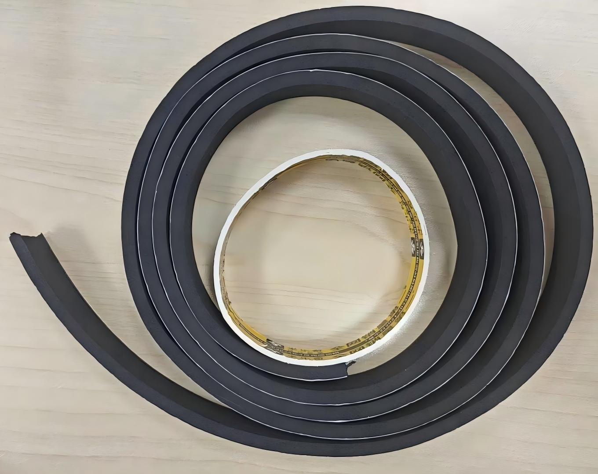

**淘宝购买链接：**

[点击查看电池防撞商品（SKU：6010611489926）](https://item.taobao.com/item.htm?id=1008514063717&skuId=6010611489926)

[返回硬件清单](#hardware-list)

### 桨叶保护罩：OddityRC XI35 Pro

**功能简介：** 用于隔离螺旋桨与外部障碍物，降低碰撞时桨叶和人员受伤的风险。

**安装方法：** 将保护罩固定在机臂或机架对应安装孔上，确保与电机、螺旋桨保持足够间隙；手动旋转螺旋桨检查无摩擦，再锁紧全部螺丝。

**参考图片：**

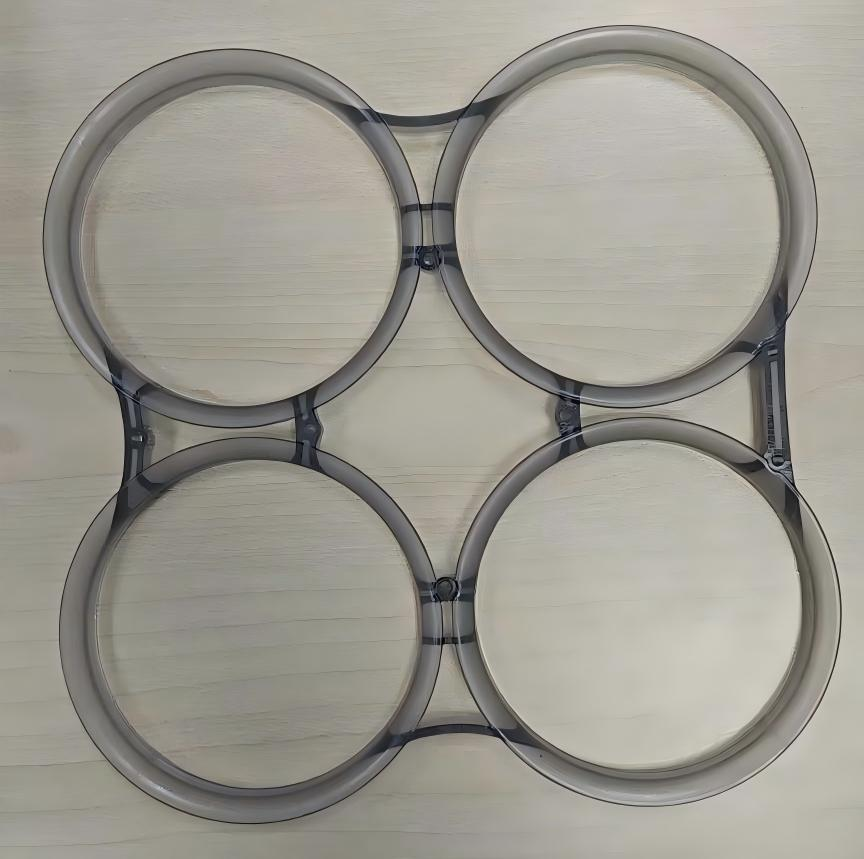

**淘宝购买链接：**

[点击查看涵道保护圈商品（SKU：5815214173777）](https://item.taobao.com/item.htm?id=930567172186&skuId=5815214173777)

[返回硬件清单](#hardware-list)

### 接收器：瑞速

**功能简介：** 接收遥控器发出的控制指令，并传递给飞控执行油门、姿态和模式控制。

**安装方法：** 固定在机架内远离电调和大电流线的位置，天线尽量伸出碳板并保持方向一致；按接口定义连接 5V、电源地和信号线，完成对码后检查通道映射。

**参考图片：**

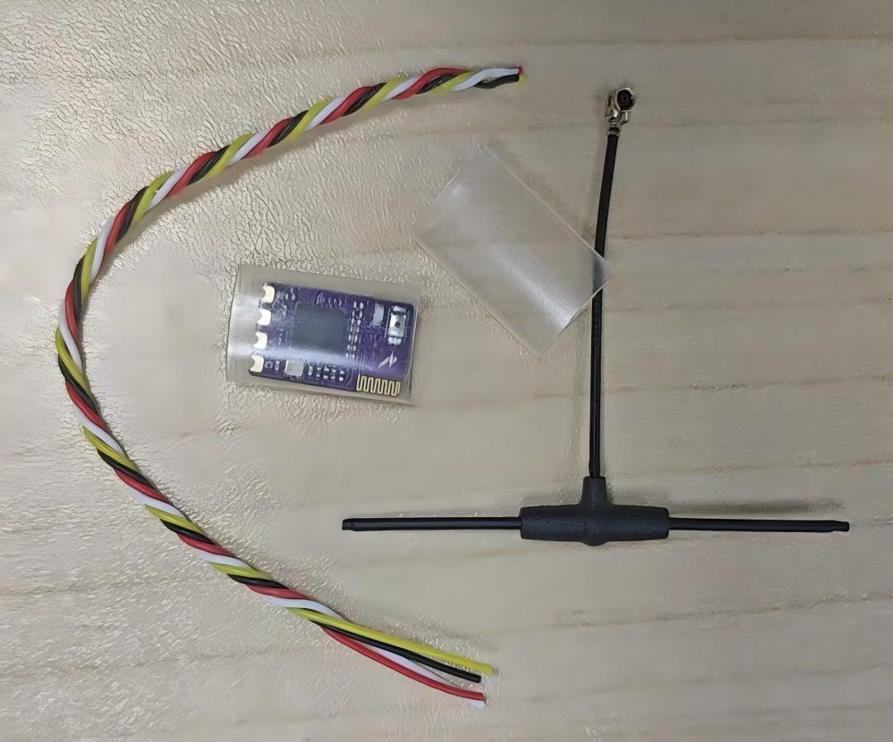

**淘宝购买链接：**

[点击查看接收机商品（SKU：6059615692701）](https://item.taobao.com/item.htm?id=1039148819082&skuId=6059615692701)

[返回硬件清单](#hardware-list)

### 遥控器

**功能简介：** 用于向接收器发送飞行控制、模式切换和安全解锁指令。

**安装方法：** 遥控器本身不安装在机体上；先装入电池并与接收器对码，再设置通道、失控保护和飞行模式，首次测试时降低油门并拆下螺旋桨。

**参考图片：**

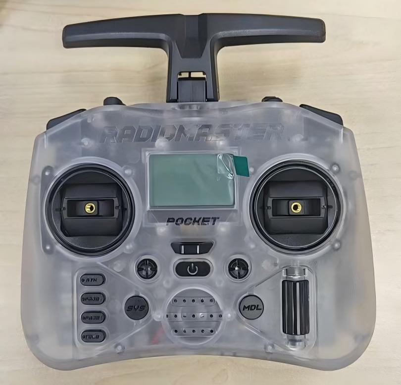

**淘宝购买链接：**

[点击查看遥控器商品（SKU：5690791865430）](https://item.taobao.com/item.htm?id=789612406107&skuId=5690791865430)

[返回硬件清单](#hardware-list)

### 电源接口：XT60 E1-M

**功能简介：** 提供电池与无人机电源系统之间的大电流可插拔连接。

**安装方法：** 先确认正负极，再将接口焊接到电池线或电源分配线上；焊点套入热缩管并固定接口，通电前用万用表检查极性和短路情况。

**参考图片：**

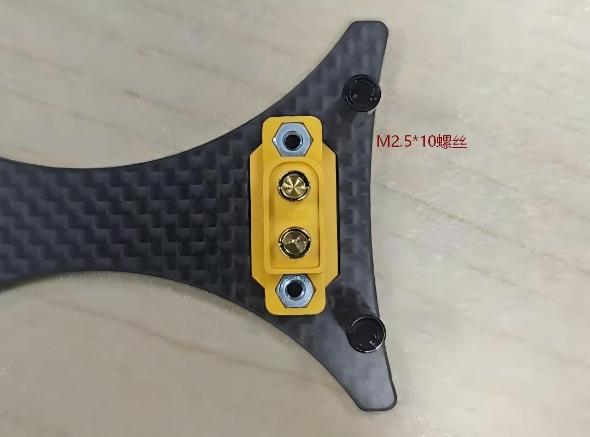

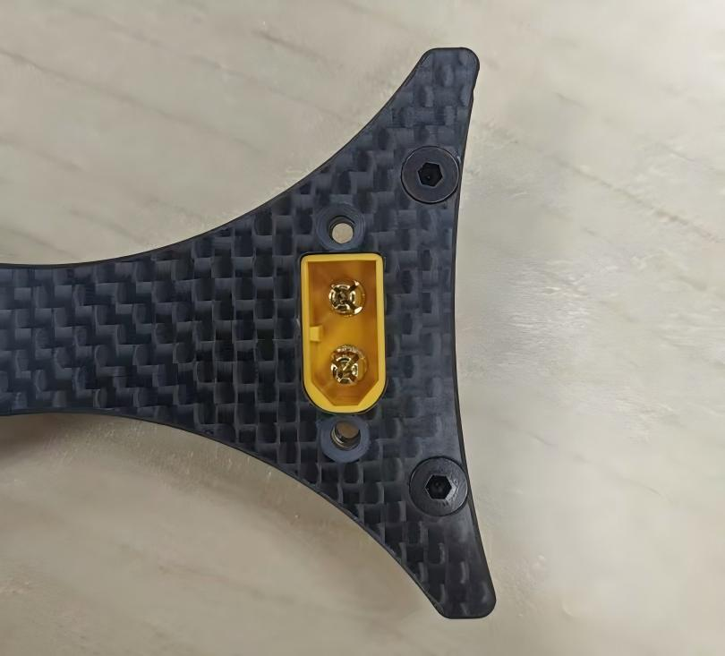

**淘宝购买链接：**

[点击查看 XT60 E1-M 公头商品（SKU：4662287222244）](https://detail.tmall.com/item.htm?id=631049982867&skuId=4662287222244)

> 机架下板为该 XT60E1-M 预留了安装位；商品不含固定用 M2 螺丝，需另行准备。

[返回硬件清单](#hardware-list)

### XT30 对（10 个装）

**功能简介：** 用于较小电流的辅助电源连接，例如风扇、灯光或小型模块。

**安装方法：** 按正负极方向焊接公母头，焊接后套热缩管并固定线材；不要将 XT30 用于超过其额定电流的主动力回路。

**淘宝购买链接：**

[点击查看 XT30 公母对商品（SKU：5808932883156）](https://item.taobao.com/item.htm?id=849568874754&skuId=5808932883156)

> 该 XT30 公母对用于机载电脑供电。

[返回硬件清单](#hardware-list)

### 计算机电源线：18 AWG 红色，1m 长

**功能简介：** 作为计算机或机载设备电源连接中的正极线，提供较大电流承载能力。

**安装方法：** 按电源系统规划裁剪长度，红线接正极端；两端压接或焊接后用热缩管绝缘，并沿机架固定，避免靠近桨叶和高温部件。配套使用4mm热缩管

**淘宝购买链接：**

[点击查看红色 18 AWG 硅胶线商品（SKU：4599704214171）](https://detail.tmall.com/item.htm?id=624893192274&skuId=4599704214171)

[返回硬件清单](#hardware-list)

### 计算机电源线：18 AWG 黑色，1m 长

**功能简介：** 作为计算机或机载设备电源连接中的负极/地线，与红色电源线配合使用。

**安装方法：** 黑线接负极或 GND 端，按照与红线相同的长度和走线方式安装；焊接后做好绝缘，避免正负极在碳板或接插件处短接。配套使用4mm热缩管

**淘宝购买链接：**

[点击查看黑色 18 AWG 硅胶线商品（SKU：4599704214172）](https://detail.tmall.com/item.htm?id=624893192274&skuId=4599704214172)

> 该 18 AWG 线用于 XT30 接线，配套使用 4mm 热缩管。

[返回硬件清单](#hardware-list)

### 相机 Type-C 线

**功能简介：** 用于连接 RealSense D455 等相机与边缘计算机，传输图像、深度数据并提供接口供电。

**安装方法：** 将 Type-C 插头完全插入相机和计算机接口，沿机架留出少量弯曲余量并用扎带固定；避免急弯、拉扯和靠近螺旋桨的位置。

**购买说明：**

>  yopo提供的相机 Type-C 链接不适配当前设备，不要购买，也不作为本清单的有效购买链接。应使用与 RealSense D455 接口匹配的正确线材。

[返回硬件清单](#hardware-list)

### 4 针串口线（20cm）

**功能简介：** 用于飞控、接收器、调试设备或机载计算机之间的 UART 串口通信。

**安装方法：** 按设备针脚定义连接 VCC、GND、TX 和 RX，通常一端 TX 对另一端 RX；上电前核对电压和针脚顺序，避免把 5V 接到不耐受的信号端。

**购买说明：**

> yopo提供的这款飞控串口线针脚间距小于实际飞控插座，无法适配，没有实际用途，不作为有效购买链接使用。

[返回硬件清单](#hardware-list)

### Type-C 调试母座（机架下板安装位）

**功能简介：** 作为可插拔的调试和烧录连接端，用于临时接入飞控或其他控制板。这个东西和公头连起来以后，公头插飞控，母座放底板上，方便调试，本质是一个转接功能。母座需要导圆角。

**安装方法：** 按调试接口的针脚顺序插接，确保母头与公头完全配合；调试完成后断电再拔出，并用标签标明接口方向。

**参考图片：**

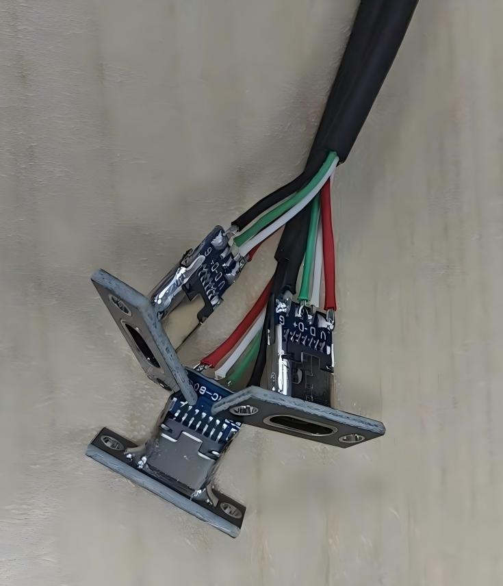

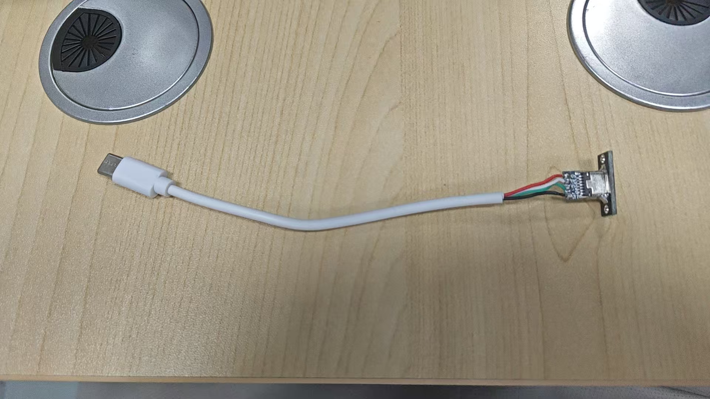

**淘宝购买链接：**

[点击查看 Type-C 调试母座商品（SKU：5102665524058）](https://item.taobao.com/item.htm?id=739748700093&skuId=5102665524058)

> 机架下板为该 Type-C 调试母座预留了专门安装位置。

[返回硬件清单](#hardware-list)

### Type-C 调试公头

**功能简介：** 与母头配合，为调试线、烧录器或外部测试设备提供插接端。直接用废弃数据线加上母座，所以这个type-c公头已经不重要了。

**安装方法：** 焊接或插接到目标板的调试针脚上，按 1 脚标记对齐；焊点完成后检查相邻针脚无短路，调试时先确认电源电压。

**参考图片：**

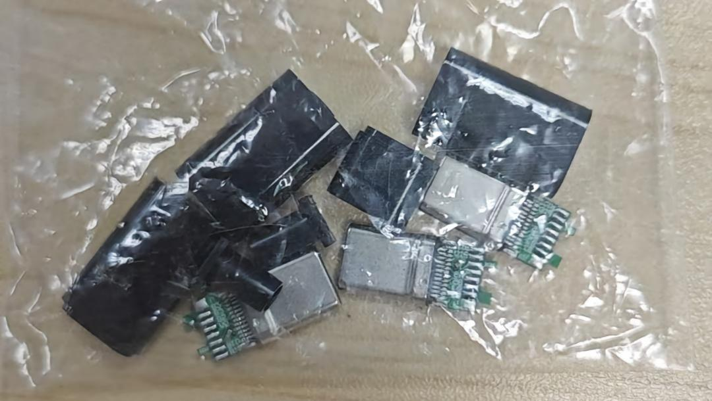

**淘宝购买链接：**

[点击查看 Type-C 调试公头商品（SKU：5077068792858）](https://item.taobao.com/item.htm?id=734551790057&skuId=5077068792858)

[返回硬件清单](#hardware-list)

### DC-DC 降压模块，输出 12V 5A

**功能简介：** 将电池或主电源的较高电压转换为稳定的 12V 电源，为机载计算机、相机或其他设备供电。

**安装方法：** 输入端接电池/电源分配端，输出端接 12V 设备；接入负载前先用万用表确认输出电压，固定模块并保留散热空间，注意输入输出正负极不能接反。

**参考图片：**

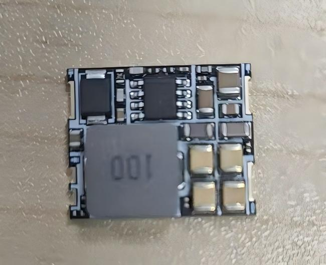

**淘宝购买链接：**

[点击查看 DC-DC 降压模块商品（SKU：6264144190644）](https://item.taobao.com/item.htm?id=677122068881&skuId=6264144190644)

> 用于将 6S 电池电压转换为稳定的 12V，为机载电脑供电。

[返回硬件清单](#hardware-list)

### 铝合金支柱：M3×12mm

**功能简介：** 用于连接上下层碳板，并为飞控、电调、计算机或其他模块提供安装间距。

**安装方法：** 将支柱对准碳板孔位，用匹配规格的螺丝从两侧锁紧；逐步交叉拧紧，避免碳板受力不均，并检查支柱没有顶到电路板元件。

**淘宝购买链接：**

[点击查看 M3×12mm 铝合金支柱商品（SKU：5379794304693）](https://item.taobao.com/item.htm?id=788489376891&skuId=5379794304693)

> 用于调整机架上下板间距；最终高度应以 45A 电调、桨叶和保护圈互不干涉为准。

[返回硬件清单](#hardware-list)

### 内六角沉头螺丝（150 个装）

**功能简介：** 用于机架、支柱和设备安装，沉头结构可减少螺丝头突出造成的干涉。

**安装方法：** 选择与孔径和支柱长度匹配的规格，螺丝头完全落入沉头孔后再适度锁紧；不要使用过长螺丝，以免顶伤电路板或电机绕组。

[返回硬件清单](#hardware-list)

### 内六角螺丝：M3×10mm

**功能简介：** 与 M3×12mm 支柱配合，用于固定机架上下板或其他结构件。

**安装方法：** 将螺丝穿过碳板和支柱端部，先手拧定位后再用内六角扳手适度锁紧；确认螺丝长度不会顶到设备或碳板另一侧。

**淘宝购买链接：**

[点击查看 M3×10mm 螺丝商品（SKU：4271874834244）](https://item.taobao.com/item.htm?id=593668961775&skuId=4271874834244)

[返回硬件清单](#hardware-list)

### 缓冲泡棉（用于电池，2m）

**功能简介：** 用于电池与碳板之间的缓冲、防滑和减振，降低电池外壳磨损。

**安装方法：** 按电池接触面裁剪并粘贴在安装区域，粘贴前清洁并晾干碳板；泡棉不能遮挡电池绑带，也不能影响电池散热和插头走线。

[返回硬件清单](#hardware-list)

### 米乐奇阻燃双面胶（黑色 EVA 泡棉，1mm 厚，20mm 宽 × 5m 长）

**功能简介：** 用于电调或其他模块与碳板之间的绝缘及辅助粘贴固定。

**安装方案与使用说明：** 按实际接触面裁剪，粘贴前清洁并擦干表面；贴合后充分压紧。该胶带只能作为绝缘和辅助固定，不能替代螺丝、支柱、绑带或扎带等主要承力结构。

**淘宝购买链接：**

[点击查看天猫商品（商品 ID：850562658093）](https://detail.tmall.com/item.htm?id=850562658093)

[返回硬件清单](#hardware-list)

### 固态电容：680µF（更紧凑）

**功能简介：** 用于吸收电源瞬态波动和高频噪声，改善电调和飞控供电稳定性。

**安装方法：** 并联在电源输入端或电调电源端，正极接正极、负极接地；引脚尽量短并用热缩管或胶固定，焊接前确认耐压高于系统最高电压。

**淘宝购买链接：**

[点击查看固态电容商品（商品 ID：721200592831）](https://item.taobao.com/item.htm?id=721200592831)

> 用于电池侧稳压；目前安装空间较紧，需要结合机架布局确定固定方式。

[返回硬件清单](#hardware-list)

### 热缩管：5mm 红色（2m）

**功能简介：** 用于正极电源线、焊点和接插件的绝缘保护，并帮助区分正负极线束。

**安装方法：** 先将热缩管套到线材上，再完成焊接；焊点冷却后用热风均匀加热收缩，避免火焰直接烧焦绝缘层。

**淘宝购买链接：**

[点击查看 5mm 红色热缩管商品（SKU：4856883900739）](https://item.taobao.com/item.htm?id=631556426007&skuId=4856883900739)

[返回硬件清单](#hardware-list)

### 热缩管：5mm 黑色（2m）

**功能简介：** 用于负极线、信号线和焊点的绝缘、防磨损及线束整理。

**安装方法：** 焊接前套入线材，焊接完成后居中覆盖裸露部分，再用热风均匀收缩；收缩后检查两端没有露铜和松动。

**淘宝购买链接：**

[点击查看 5mm 黑色热缩管商品（SKU：4856883900835）](https://item.taobao.com/item.htm?id=631556426007&skuId=4856883900835)

[返回硬件清单](#hardware-list)

### BB 响

**功能简介：** 作为飞控的声音提示器，用于低电量、解锁状态、失控或定位提示。

**安装方法：** 按正负极和信号定义连接到飞控蜂鸣器接口，固定在机架外侧或容易听见的位置；避免让蜂鸣器接触螺旋桨和高温电调。

**参考图片：**

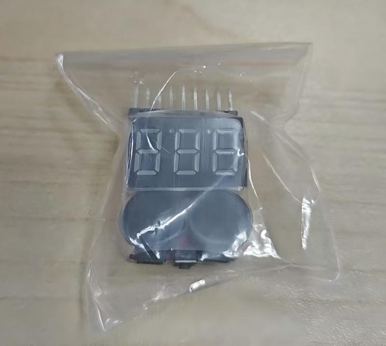

**淘宝购买链接：**

[点击查看 BB 响商品（SKU：5619084980840）](https://item.taobao.com/item.htm?id=843832893059&skuId=5619084980840)

[返回硬件清单](#hardware-list)

### XT60 公母头（5 对）

**功能简介：** 用于制作电池、电源分配板和电调之间的高电流可插拔连接。

**安装方法：** 先确定公母头和正负极布局，再分别焊接电源线；焊后套热缩管并检查插拔方向，首次接电前使用万用表确认没有短路。

**淘宝购买链接：**

[点击查看 XT60 公母头对商品（SKU：6157498031900）](https://item.taobao.com/item.htm?id=1001836482132&skuId=6157498031900)

[返回硬件清单](#hardware-list)

### 电池绑带：凯夫拉 20×280mm 防滑扎带

**功能简介：** 用于固定 5 寸及 7 寸穿越机电池，防止电池在飞行过程中移动或脱落。

**规格：** 凯夫拉材质，20×280mm，防滑款，数量 4。

**安装方法：** 将绑带穿过机架或电池固定孔，绕过电池后穿回并收紧；保持电池位于重心附近，检查绑带尾端不会接触螺旋桨。

**淘宝购买链接：**

[点击查看商品（商品 ID：752606680898）](https://item.taobao.com/item.htm?id=752606680898)

[返回硬件清单](#hardware-list)

### 3M 背胶魔术贴：黑色，2cm 宽，3m 勾面 + 3m 毛面

**功能简介：** 用于可拆卸固定电池、电调及其他机载设备，方便后续维护和调整。

**规格：** 黑色，宽 2cm，3m 勾面加 3m 毛面，数量 1 套。

**安装方法：** 先清洁并擦干粘贴面，将勾面和毛面分别贴在机架与设备上，压紧后等待胶面稳定；重要设备仍需配合绑带或扎带固定。

**淘宝购买链接：**

[点击查看商品（商品 ID：911291973150）](https://item.taobao.com/item.htm?id=911291973150)

[返回硬件清单](#hardware-list)

### 尼龙扎带：白色，25cm，中粗，100条装

**功能简介：** 用于固定电调、电源线、信号线和其他机架附件，也可作为双面胶固定后的辅助防脱落措施。

**规格：** 白色，25cm，中粗，100条装，数量 1 包。

**安装方法：** 沿机架走线方向捆扎线束，预留插头和维修余量，锁紧后剪掉多余尾部并将剪口朝外，避免划伤线材或手指。

**淘宝购买链接：**

[点击查看商品（商品 ID：552436283189）](https://item.taobao.com/item.htm?id=552436283189)

[返回硬件清单](#hardware-list)

### 热缩管：黑色，圆直径 4mm，按 2m 散卖

**功能简介：** 用于电源线、焊点和接插件的绝缘保护及防磨损处理。

**规格：** 黑色，圆直径 4mm，购买长度 2m。

**安装方法：** 在焊接前套入较粗的电源线或接插件，焊接后移动到裸露位置，用热风均匀加热收缩，确认完全包覆焊点。

**淘宝购买链接：**

[点击查看商品（商品 ID：631556426007）](https://item.taobao.com/item.htm?id=631556426007)

[返回硬件清单](#hardware-list)

### 热缩管：黑色，圆直径 2mm，按 2m 散卖

**功能简介：** 用于较细电线、信号线和焊点的绝缘保护及束线处理。

**规格：** 黑色，圆直径 2mm，购买长度 2m。

**安装方法：** 在焊接前套入细电线或信号线，焊接完成后覆盖接头并用热风收缩；不要让热风长时间集中在同一点。

**淘宝购买链接：**

[点击查看商品（商品 ID：631556426007）](https://item.taobao.com/item.htm?id=631556426007)

[返回硬件清单](#hardware-list)

### 铝合金支柱：M3×20mm，亮黑色

**功能简介：** 用于上下层碳板之间的结构连接和高度间隔，为飞控、电调等设备留出安装空间。

**规格：** M3×20mm，亮黑色，数量 20。

**安装方法：** 将支柱安装在上下碳板对应的 M3 孔位，使用匹配的 M3 螺丝锁紧；先手拧定位，再交叉均匀收紧，避免挤压板上设备。

**淘宝购买链接：**

[点击查看商品（商品 ID：788489376891）](https://item.taobao.com/item.htm?id=788489376891)

[返回硬件清单](#hardware-list)

### 铝合金支柱：M3×60mm，亮黑色

**功能简介：** 用于需要较大间距的上下板结构连接和高度调整。

**规格：** M3×60mm，亮黑色，合计数量 10；来自两笔相同规格订单。

**安装方法：** 仅在当前结构确实需要较大间距时使用；安装前确认 60mm 高度不会与桨叶、保护圈或线束冲突，配合螺丝胶适度锁紧并检查机架平行度。

**淘宝购买链接：**

[点击查看商品（商品 ID：788489376891）](https://item.taobao.com/item.htm?id=788489376891)

[返回硬件清单](#hardware-list)

### 尼龙螺丝：M2×20mm，白色，30颗装

**功能简介：** 用于轻量化、绝缘的设备安装和结构固定。

**规格：** 白色尼龙螺丝，M2×20mm，30颗装。

**安装方法：** 将螺丝穿过设备安装孔与支架，用 M2 尼龙螺母或螺纹孔固定；锁紧到不晃动即可，避免过度拧紧导致尼龙螺纹损坏。

**淘宝购买链接：**

[点击查看商品（商品 ID：43496648279）](https://item.taobao.com/item.htm?id=43496648279)

[返回硬件清单](#hardware-list)

### 尼龙螺母：M2，白色，50颗装

**功能简介：** 与 M2 螺丝配合使用，用于绝缘安装和轻量化固定。

**规格：** 白色尼龙六角螺母，M2，50颗装。

**安装方法：** 与 M2 螺丝配套使用，先让螺母端面贴合支架，再用手拧紧或使用小扳手轻轻收紧；确认尼龙件不受高温和大电流接点影响。

**淘宝购买链接：**

[点击查看商品（商品 ID：38154327797）](https://item.taobao.com/item.htm?id=38154327797)

[返回硬件清单](#hardware-list)

### 内六角沉头螺丝：M3×20mm，100只装

**功能简介：** 用于飞行器机架、支柱和设备安装的沉头固定，减少螺丝头对周边部件的干涉。

**规格：** M3×20mm，100只装。

**安装方法：** 让沉头面朝外并完全落入机架沉头孔，选择不顶到设备内部的长度；使用内六角扳手均匀锁紧，必要时在金属螺纹处点少量螺丝胶。

**淘宝购买链接：**

[点击查看商品（商品 ID：593668961775）](https://item.taobao.com/item.htm?id=593668961775)

[返回硬件清单](#hardware-list)

### 内六角沉头螺丝：M2.5×10mm，100只装

**功能简介：** 用于小型设备、支架和电路板附件的沉头固定。

**规格：** M2.5×10mm，100只装。

**安装方法：** 用于较薄的支架或小型模块，安装前确认螺丝不会穿透板材或压到 PCB；沉头面与板面齐平后适度锁紧。

**淘宝购买链接：**

[点击查看商品（商品 ID：593668961775）](https://item.taobao.com/item.htm?id=593668961775)

[返回硬件清单](#hardware-list)

### 硅胶线：12 AWG 红色，3.4平方，1m 长

**功能简介：** 用于电池、电源接口和电调之间的大电流供电连接；红色通常用于正极。

**规格：** 12 AWG，3.4平方，红色，1m，数量 2。

**安装方法：** 按实际长度裁剪并剥线，红线连接正极端；两端压接或焊接后用热缩管绝缘，走线时避免急弯和靠近旋转部件。

**淘宝购买链接：**

[点击查看商品（商品 ID：624893192274）](https://item.taobao.com/item.htm?id=624893192274)

[返回硬件清单](#hardware-list)

### 硅胶线：12 AWG 黑色，3.4平方，1m 长

**功能简介：** 用于电池、电源接口和电调之间的大电流供电连接；黑色通常用于负极。

**规格：** 12 AWG，3.4平方，黑色，1m，数量 2。

**安装方法：** 按实际长度裁剪并剥线，黑线连接负极或 GND 端；与红线分开检查后再焊接，完成后用热缩管覆盖所有裸露导体。

**淘宝购买链接：**

[点击查看商品（商品 ID：624893192274）](https://item.taobao.com/item.htm?id=624893192274)

[返回硬件清单](#hardware-list)

### 硅胶线：28 AWG 绿色，0.08平方，5m 长

**功能简介：** 用于低电流信号、控制和辅助连接线路。

**规格：** 28 AWG，0.08平方，绿色，5m。

**安装方法：** 按信号线长度裁剪并标记两端，焊接或压接到对应接口后固定在线束中；远离电机三相线和大电流电源线，避免信号干扰。

**淘宝购买链接：**

[点击查看商品（商品 ID：736162720327）](https://item.taobao.com/item.htm?id=736162720327)

[返回硬件清单](#hardware-list)

### 硅胶线：28 AWG 白色，0.08平方，5m 长

**功能简介：** 用于低电流信号、控制和辅助连接线路。

**规格：** 28 AWG，0.08平方，白色，5m。

**安装方法：** 按信号线长度裁剪并标记两端，焊接或压接到对应接口后固定在线束中；两端做好标签，防止与其他颜色线混接。

**淘宝购买链接：**

[点击查看商品（商品 ID：736162720327）](https://item.taobao.com/item.htm?id=736162720327)

[返回硬件清单](#hardware-list)

### 硅胶线：28 AWG 红色，0.08平方，5m 长

**功能简介：** 用于低电流信号、控制和辅助连接线路；红色可作为正极或电源标识线。

**规格：** 28 AWG，0.08平方，红色，5m。

**安装方法：** 可用于低电流正极或信号标识线，裁剪后先套入热缩管再焊接；确认连接端的电压等级，不能替代大电流动力线。

**淘宝购买链接：**

[点击查看商品（商品 ID：736162720327）](https://item.taobao.com/item.htm?id=736162720327)

[返回硬件清单](#hardware-list)

### 硅胶线：28 AWG 黑色，0.08平方，5m 长

**功能简介：** 用于低电流信号、控制和辅助连接线路；黑色可作为负极或地线标识线。

**规格：** 28 AWG，0.08平方，黑色，5m。

**安装方法：** 可用于低电流负极、地线或信号线，裁剪后先套入热缩管再焊接；沿机架固定并与动力线保持适当间距。

**淘宝购买链接：**

[点击查看商品（商品 ID：736162720327）](https://item.taobao.com/item.htm?id=736162720327)

[返回硬件清单](#hardware-list)

### 螺丝胶：263 红色，高强度耐油性，50mL

**功能简介：** 用于螺纹连接的防松固持，降低电机、支柱和机架螺丝因振动松动的风险。

**规格：** 263 红色，高强度耐油性，50mL。

**安装方法：** 清洁并擦干螺纹，在外螺纹上涂少量胶后装配并擦去溢出部分；按照产品固化时间等待后再进行高负载飞行，避免涂到轴承或可拆卸电气接口。

**淘宝购买链接：**

[点击查看商品（商品 ID：656857336032）](https://item.taobao.com/item.htm?id=656857336032)

[返回硬件清单](#hardware-list)

### 公牛插排：B5440，3m，带过载保护

**功能简介：** 用于无人机装配、焊接、调试时为电烙铁、电源适配器和其他实验设备提供交流电源。该物品属于装配辅助设备，不安装在无人机上。

**规格：** B5440，3m，带过载保护，数量 1。

**安装方法：** 该插排放置在装配工作台附近使用，不安装在无人机上；使用前检查额定功率和插头状态，焊接完成后关闭电源并拔下设备。

**淘宝购买链接：**

[点击查看商品（商品 ID：538992099820）](https://item.taobao.com/item.htm?id=538992099820)

[返回硬件清单](#hardware-list)

### 936 烙铁头：黑金刚 SK 小刀型

**功能简介：** 用于 936 恒温电烙铁进行电源线、信号线和电子元件焊接。

**规格：** 黑金刚 SK 小刀型，1 个装（商品页面标注买 3 送 1）。

**安装方法：** 关闭并拔下 936 电烙铁电源后，将旧烙铁头拔出并插入新烙铁头；通电升温后给烙铁头上锡，使用时保持尖端清洁并避免干烧。

**淘宝购买链接：**

[点击查看商品（商品 ID：608790591531）](https://item.taobao.com/item.htm?id=608790591531)

[返回硬件清单](#hardware-list)

### 焊锡丝：63% 锡，1.2mm，55g/卷，含松香芯

**功能简介：** 用于焊接电源线、接插件、飞控外围线束和其他电子连接点。

**规格：** 63% 焊锡量，直径 1.2mm，55g/卷，含松香助焊芯。

**安装方法：** 将焊锡丝放在焊点附近，先用烙铁加热导体和焊盘，再送入适量焊锡；焊点冷却后检查是否饱满、无虚焊和桥接。

**淘宝购买链接：**

[点击查看商品（商品 ID：541908805726）](https://item.taobao.com/item.htm?id=541908805726)

[返回硬件清单](#hardware-list)

### 3K 东丽碳纤维板：黑色，固定翼定制加工

**功能简介：** 用于定制无人机机架、固定翼结构件或其他需要高强度、轻量化的板材部件。

**规格：** 3K 东丽碳纤维板，黑色，固定翼定制加工。订单表中的商品数量为 440，疑似为定制尺寸或计价单位，本清单按 1 项材料订单记录。

**安装方法：** 按设计图纸定位、切割和钻孔，打磨边缘后用螺丝、支柱或胶粘方式安装；加工碳纤维时佩戴护目镜和口罩，并清理导电粉尘，避免短路电子部件。

**淘宝购买链接：**

[点击查看商品（商品 ID：40340403528）](https://item.taobao.com/item.htm?id=40340403528)

[返回硬件清单](#hardware-list)

### PETG 3D 打印定制件

**功能简介：** 用于制作无人机安装支架、保护件、线束固定件和其他定制结构件。

**规格：** PETG 材料，3D 打印定制加工，数量 6。

**安装方法：** 打印件到货后先检查尺寸和毛刺，试装确认孔位与机架匹配，再用螺丝、尼龙螺母或扎带固定；避免将 PETG 件长期贴近电调散热面或高温部件。

**淘宝购买链接：**

[点击查看商品（商品 ID：809701547241）](https://item.taobao.com/item.htm?id=809701547241)

[返回硬件清单](#hardware-list)
